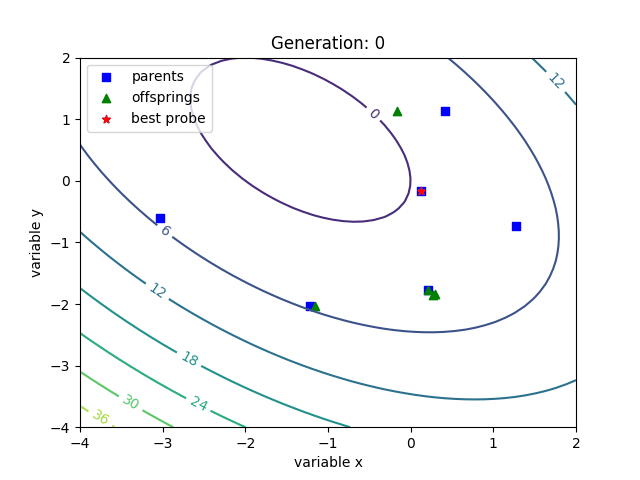

<b>Pierwsze uruchomienie projektu:</b>

a) Z użyciem pip 
Jeśli pip nie jest zainstalowany:
https://pip.pypa.io/en/stable/installation/
pip install --upgrade pip 
pip install -r requirements.txt 
python3 main.py 

b) bez użycia pip 
Niezbędne biblioteki do prawidłowego funkcjonowania: 
matplotlib 
numpy 
imageio 

<b>Przykładowa animacja procesu ewolucyjnego:</b>

<b>Podstawowe dane pomagające w zapoznaniu się z projektem:</b>

1. Struktura: 

Plik główny 
  main.py -> Przykład wykorzystania algorytmu (zawiera wszystkie zmienne i dane niezbędne do konfiguracji algorytmu) 

Serwisy (klasy nie wymagające instancji): 
  converter.py -> Służy do konwersji dec -> gray_code, gray_code -> dec 
  mutator.py -> Służy do zastosowania jednej bądź wielu mutacji na genotypie dziecka (zaimplementowane zostały różne rodzaje mutacji) 

Klasy: 
  probe.py -> Definicja poszczególnego osobnika 
  plotter.py -> Odpowiada za animację procesu ewolucyjnego 
  simulation.py -> Algorytm ewolucyjny 

2. Opis zmiennych zastosowanych w algorytmie:

bounds -> określa przestrzeń na której wyszukiwane jest minimum lokalne 
bit_size -> określa ilość bitów przypadającą na każdy chromosom 
population_size -> określa ilość osobników w populacji 
generations -> określa ile pokoleń ma trwać algorytm genetyczny 
tournament_size -> określa ile osobników jest wybierane do turnieju (turniej to wybieranie najlepszego osobnika z losowo wybranej puli turniejowej) 
settings -> Określa które mutacje mają zostać wykonane na osobniku potomnym. 

3. Opis mutatorów: 

https://www.tutorialspoint.com/genetic_algorithms/genetic_algorithms_mutation.htm 

4. Opis funkcjonalności algorytmu ewolucyjnego: 

Wykonanie procesu ewolucyjnego dla początkowej puli osobników 
Wyświetlanie procesu w formie animacji 
Export danych procesu ewolucyjnego do formatu json 
Zapis aniamcji w formie pliku .gif 
Zapis poszczególnych klatek animacji 
